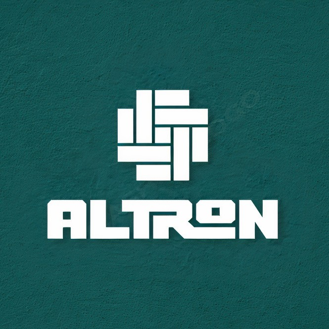

# Altron Rich Text Svelte Component



## Introduction

The **Altron Rich Text Svelte Component** is a powerful and versatile rich text editor for Svelte applications. It allows users to create, edit, and manage structured text content by adding various blocks with associated data. This component is designed to be highly customizable, responsive on mobile devices, and supportive of both editing and viewing modes.

## Installation

To get started with the Altron Rich Text Svelte Component, you can install it via your package manager of choice:

```bash
npm install altron-rich-text
# or
yarn add altron-rich-text
# or 
pnpm i altron-rich-text
```

## Basic Usage

To use the Altron Rich Text editor, import the `AltronRichText` component and include it in your Svelte application.

```svelte
<script>
  import { AltronRichText } from 'altron-rich-text';
</script>

<AltronRichText />
```

## Data Structure

The rich text editor works with a specific data structure known as `dataBlock`. This type includes:

- `image`: Represents image blocks with data such as base64 representation, name, and caption.
- `paragraph`: Basic text blocks.
- `code`: Code blocks with text content and a specified programming language.
- `quote`: Text quotes with owner attribution.
- `header`: Header blocks with different levels (1 to 4) and associated text.
- `space`: Empty space blocks with a specified size.
- `list`: List blocks with items and an ordered or unordered list type.

```ts
type dataBlock =
| { name: 'image'; id: string; data: { base64: string; name: string; caption: string } }
| { name: 'paragraph'; id: string; data: { text: string } }
| { name: 'code'; id: string; data: { text: string; lang: languages } }
| { name: 'quote'; id: string; data: { text: string; owner: string } }
| { name: 'header'; id: string; data: { text: string; level: 1 | 2 | 3 | 4 } }
| { name: 'space'; id: string; data: { size: number } }
| { name: 'list'; id: string; data: { items: string[]; type: 'ordered' | 'unordered' } };
```

### Block States

Each block in the Altron Rich Text editor can exist in one of three states: 

1. **View State:** In this state, the block displays its information based on its type and associated data. 
2. **Focus State:** When a user clicks on a block, it switches to the focus state. In this state, the block is wrapped with a wrapper that provides options for deleting the block and reordering it (moving it up or down). 
3. **Edit State:** Upon another click, the block enters the edit state, allowing the user to modify the block's information. ## Customization

## Customization

You can customize various aspects of the rich text editor:

- **Colors:**
  - `primaryColor`: Used in both focus and view states.
  - `secondaryColor`: Specifically used in the edit state.
  - `textColor`: Defines the text color within the editor.
  - `bgColor`: Specifies the background color of the editor.

- **Fonts:**
  - `headerFont`: Set the font for header elements (e.g., h1, h2, h3, h4).
  - `bodyFont`: Define the font for general text elements (e.g., p, span, label, li, a).

- **Font Sizes and Line Heights:**
  - Customize font sizes using `h1`, `h2`, `h3`, `h4`, `body`, `small`.
  - Set line heights for various text elements using `lh1`, `lh2`, `lh3`, `lh4`, and `lbody`.

- **Custom Code Themes:** Users can import and apply custom themes from `svelte-highlight` for code highlighting by setting the `codeTheme` prop.

- **Initial Data:** You can prepopulate the editor with initial data by passing an array of `dataBlock` to the `initialData` prop.

- **Custom Code Block Languages:** Define the list of languages users can use for code blocks with the `codeBlockLanguages` prop. By default, it includes JavaScript, Java, C, CSS, TypeScript, Python, and C#.

- **Custom spacing:** By default **altron** separate blocks with 10px gap and have **margin-block** set to 30px you can change that using **blocksGap** and **marginBlock** props .

- **Custom Components:** You can replace the default view components for various block types with your custom components. For example:
    - `customImage` for image blocks
    - `customCode` for code blocks
    - `customList` for list blocks
    - `customHeader` for header blocks
    - `customParagraph` for paragraph blocks
    - `customQuote` for quote blocks

```ts
export let customImage: ComponentType<
SvelteComponent<{ base64: string; name: string; caption: string }>
> = ViewImage;

export let customCode: ComponentType<SvelteComponent<{ text: string; lang: languages }>> =
ViewCode;

export let customList: ComponentType<
SvelteComponent<{ items: string[]; type: 'ordered' | 'unordered' }>
> = ViewList;

export let customHeader: ComponentType<SvelteComponent<{ text: string; level: 1 | 2 | 3 | 4 }>> =
ViewHeader;

export let customParagraph: ComponentType<SvelteComponent<{ text: string }

>> = ViewParagraph;

export let customQuote: ComponentType<SvelteComponent<{ text: string; owner: string }>> =
ViewQuote;
```

## View Mode

The Altron Rich Text editor includes a `viewMode` prop, which, when set to `true`, allows you to use the editor in a read-only mode. In this mode, you can display existing content without enabling editing.

```svelte
<script>
  import { AltronRichText } from 'altron-rich-text';
</script>

<AltronRichText viewMode={true} />
```

## The getData Function

The package provides a function to retrieve the `dataBlock` at any given moment. Here is an example:

```ts
<script>
  import { AltronRichText, getData } from 'altron-rich-text';
</script>

<AltronRichText viewMode={true} />
<Button on:click={()=>{
  const data = getData(); // returns dataBlock[] type
  saveData(data);
}}>Save</Button>
```

## Svelte Highlight

The package uses `svelte-highlight` with `autoHighlight` functionality for code highlighting. This feature enhances the visual representation of code blocks in your rich text editor. However, note that enabling `autoHighlight` may result in a larger bundle size. You may need to consider using customCode component.

## Props

Here are all AltronRichText props and their default values:

```ts
export let initialData: dataBlock[] = [];

export let viewMode = false;

export let blocksGap = 10;

export let marginBlock = 30;

export let headerFont = `Verdana, sans-serif`;

export let bodyFont = `Helvetica, sans-serif`;

export let primaryColor = '#3366FF';

export let secondaryColor = '#1eeb36';

export let textColor = '#121212';

export let bgColor = '#ffffff';

export let h1 = 'clamp(1.8rem, calc(1.8rem + ((1vw - 0.48rem) * 0.9722)), 2.1rem)';

export let h2 = 'clamp(1.5rem, calc(1.5rem + ((1vw - 0.48rem) * 0.9722)), 1.8rem)';

export let h3 = 'clamp(1.2rem, calc(1.2rem + ((1vw - 0.48rem) * 0.9722)), 1.5rem)';

export let h4 = 'clamp(1.125rem, calc(1.15rem + ((1vw - 0.48rem) * 0.3472)), 1.2rem)';

export let body = 'clamp(1rem, calc(1rem + ((1vw - 0.48rem) * 0.1736)), 1.125rem)';

export let small = 'clamp(0.875rem, calc(0.875rem + ((1vw - 0.48rem) * 0.1736)), 1rem)';

export let lh1 = '1.3';

export let lh2 = '1.35';

export let lh3 = '1.4';

export let lh4 = '1.5';

export let lbody = '1.6';

export let codeTheme: string = nightOwl;

export let customImage: ComponentType<
SvelteComponent<{ base64: string; name: string; caption: string }>
> = ViewImage;

export let customCode: ComponentType<SvelteComponent<{ text: string; lang: languages }>> =
ViewCode;

export let customList: ComponentType<
SvelteComponent<{ items: string[]; type: 'ordered' | 'unordered' }>
> = ViewList;

export let customHeader: ComponentType<SvelteComponent<{ text: string; level: 1 | 2 | 3 | 4 }>> =
ViewHeader;

export let customParagraph: ComponentType<SvelteComponent<{ text: string }>> = ViewParagraph;

export let customQuote: ComponentType<SvelteComponent<{ text: string; owner: string }>> =
ViewQuote;

export let codeBlockLanguages: languages[] = [
'javascript',
'java',
'c',
'css',
'typescript',
'python',
'csharp'
];
```
